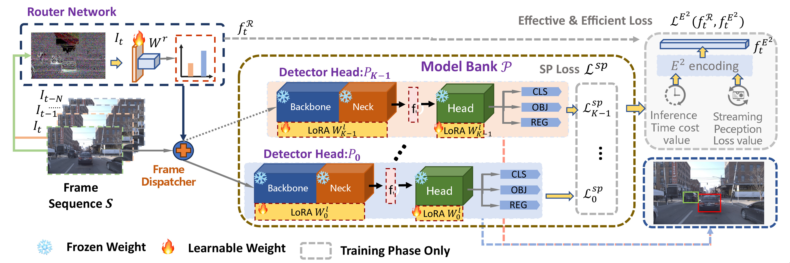

# DyRoNet: A Low-Rank Adapter Enhanced Dynamic Routing Network for Streaming Perception

[Website](https://tastevision.github.io/DyRoNet/)

This repository provides the source code for the paper titled *DyRoNet: A Low-Rank Adapter Enhanced Dynamic Routing Network for Streaming Perception* along with explanations of the relevant training and testing methods.

DyRoNet (Dynamic Routing Network) is a novel real-time streaming perception method. Its dynamic property enables the model to adapt to various environmental conditions, and by selecting appropriate sub-models from the model bank, it achieves optimal performance globally.

<p align='center'>
  
</p>

## Installation

The basic anaconda environment and follow the install guidelines from [DAMO-StreamNet](https://github.com/zhiqic/DAMO-StreamNet). Based on that, an additional package *loralib* is needed:

```shell
pip install loralib
```

## Quick Start

### Dataset Preparation

Follow [Argoverse-HD setup instructions](https://github.com/yancie-yjr/StreamYOLO#quick-start)

### Model Preparation

Due to the utilization of pre-trained parameters from  [StreamYOLO](https://github.com/yancie-yjr/StreamYOLO), [LongShortNet](https://github.com/LiChenyang-Github/LongShortNet), and [DAMO-StreamNet](https://github.com/zhiqic/DAMO-StreamNet) in DyRoNet, it is necessary to download the following weight files before training or evaluating DyRoNet:

| Model              | Download URL                                                 | Target Path             |
| ------------------ | ------------------------------------------------------------ | ----------------------- |
| StreamYOLO (S)     | [link](https://github.com/yancie-yjr/StreamYOLO/releases/download/0.1.0rc/s_s50_one_x.pth) | `./models/checkpoints/` |
| StreamYOLO (M)     | [link](https://github.com/yancie-yjr/StreamYOLO/releases/download/0.1.0rc/m_s50_one_x.pth) | `./models/checkpoints/` |
| StreamYOLO (L)     | [link](https://github.com/yancie-yjr/StreamYOLO/releases/download/0.1.0rc/l_s50_one_x.pth) | `./models/checkpoints/` |
| LongShortNet (S)   | [link](https://drive.google.com/file/d/13ESdjetcccOKnU0fg54b6czuxBH76C_7/view?usp=share_link) | `./models/checkpoints/` |
| LongShortNet (M)   | [link](https://drive.google.com/file/d/1AFzD2bTSTtuCCWBk2AnU1t9uHVGD1cM_/view?usp=share_link) | `./models/checkpoints/` |
| LongShortNet (L)   | [link](https://drive.google.com/file/d/15D6VL_QcL1qBYjBmZCAEa0PNp0TM67vg/view?usp=share_link) | `./models/checkpoints/` |
| DAMO-StreamNet (S) | [link](https://drive.google.com/file/d/15Mi8ShE3PiVdEBMzfG2BlVkGFdWPNL19/view?usp=share_link) | `./models/checkpoints/` |
| DAMO-StreamNet (M) | [link](https://drive.google.com/file/d/1P3STvXZPpkzJB6EmsRc0RbSM0T_D0U1Q/view?usp=share_link) | `./models/checkpoints/` |
| DAMO-StreamNet (L) | [link](https://drive.google.com/file/d/1V__om759s2vCXy5L8A1oP8qQqPbPms5A/view?usp=share_link) | `./models/checkpoints/` |

The Teacher models of DAMO-StreamNet available [here](https://drive.google.com/drive/folders/1I0R68LqXt7yoUtJ-i1-uynW6dsKSO49Y?usp=sharing).

### Training

```shell
bash run_train_lora.sh # for lora fine-tuning
bash run_train_full.sh # for full fine-tuning
```

### Evaluation

```shell
bash run_eval_lora.sh # for lora fine-tuning
bash run_eval_full.sh # for full fine-tuning
```
