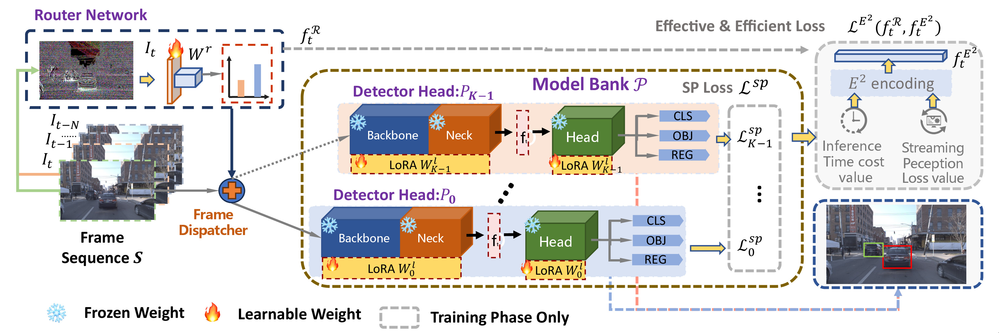

# DyRoNet: Dynamic Routing and Low-Rank Adapters for Autonomous Driving Streaming Perception

This repository provides the source code for the paper titled *DyRoNet: Dynamic Routing and Low-Rank Adapters for Autonomous Driving Streaming Perception* along with explanations of the relevant training and testing methods.

The advancement of autonomous driving systems hinges on the ability to achieve low-latency and high-accuracy perception. To address this critical need, this paper introduces *Dynamic Routering Network (DyRoNet)*, a low-rank enhanced dynamic routing framework designed for streaming perception in autonomous driving systems. DyRoNet integrates a suite of pre-trained branch networks, each meticulously fine-tuned to function under distinct environmental conditions. At its core, the framework offers a speed router module, developed to assess and route input data to the most suitable branch for processing. This approach not only addresses the inherent limitations of conventional models in adapting to diverse driving conditions but also ensures the balance between performance and efficiency. Extensive experimental evaluations demonstrating the adaptability of DyRoNet to diverse branch selection strategies, resulting in significant performance enhancements across different scenarios. This work not only establishes a new benchmark for streaming perception but also provides valuable engineering insights for future work. For further information and updates on the project, please visit https://tastevision.github.io/DyRoNet/.

This paper already accepted by WACV 2025.

<p align='center'>
  
</p>


## Installation

The basic anaconda environment and follow the install guidelines from [DAMO-StreamNet](https://github.com/zhiqic/DAMO-StreamNet). Based on that, an additional package *loralib* is needed:

```shell
pip install loralib
```

## Quick Start

### Dataset Preparation

Follow [Argoverse-HD setup instructions](https://github.com/yancie-yjr/StreamYOLO#quick-start)

### Model Preparation

Due to the utilization of pre-trained parameters from  [StreamYOLO](https://github.com/yancie-yjr/StreamYOLO), [LongShortNet](https://github.com/LiChenyang-Github/LongShortNet), and [DAMO-StreamNet](https://github.com/zhiqic/DAMO-StreamNet) in DyRoNet, it is necessary to download the following weight files before training or evaluating DyRoNet:

| Model              | Download URL                                                 | Target Path             |
| ------------------ | ------------------------------------------------------------ | ----------------------- |
| StreamYOLO (S)     | [link](https://github.com/yancie-yjr/StreamYOLO/releases/download/0.1.0rc/s_s50_one_x.pth) | `./models/checkpoints/` |
| StreamYOLO (M)     | [link](https://github.com/yancie-yjr/StreamYOLO/releases/download/0.1.0rc/m_s50_one_x.pth) | `./models/checkpoints/` |
| StreamYOLO (L)     | [link](https://github.com/yancie-yjr/StreamYOLO/releases/download/0.1.0rc/l_s50_one_x.pth) | `./models/checkpoints/` |
| LongShortNet (S)   | [link](https://drive.google.com/file/d/13ESdjetcccOKnU0fg54b6czuxBH76C_7/view?usp=share_link) | `./models/checkpoints/` |
| LongShortNet (M)   | [link](https://drive.google.com/file/d/1AFzD2bTSTtuCCWBk2AnU1t9uHVGD1cM_/view?usp=share_link) | `./models/checkpoints/` |
| LongShortNet (L)   | [link](https://drive.google.com/file/d/15D6VL_QcL1qBYjBmZCAEa0PNp0TM67vg/view?usp=share_link) | `./models/checkpoints/` |
| DAMO-StreamNet (S) | [link](https://drive.google.com/file/d/15Mi8ShE3PiVdEBMzfG2BlVkGFdWPNL19/view?usp=share_link) | `./models/checkpoints/` |
| DAMO-StreamNet (M) | [link](https://drive.google.com/file/d/1P3STvXZPpkzJB6EmsRc0RbSM0T_D0U1Q/view?usp=share_link) | `./models/checkpoints/` |
| DAMO-StreamNet (L) | [link](https://drive.google.com/file/d/1V__om759s2vCXy5L8A1oP8qQqPbPms5A/view?usp=share_link) | `./models/checkpoints/` |

The Teacher models of DAMO-StreamNet available [here](https://drive.google.com/drive/folders/1I0R68LqXt7yoUtJ-i1-uynW6dsKSO49Y?usp=sharing).

### Training

```shell
bash run_train_lora.sh # for lora fine-tuning
bash run_train_full.sh # for full fine-tuning
```

### Evaluation

You can obtain the weight files using the training method mentioned above. Meanwhile, we also provide the optimal weights which you can download from [here](https://drive.google.com/drive/folders/1FzXSi1rG9ersm4JMQSvspbaz6Fzs_xpy?usp=sharing) and place them under the `./models/` directory.

```shell
bash run_eval_lora.sh # for lora fine-tuning
bash run_eval_full.sh # for full fine-tuning
```

## Citation

If you think this work is helpful, please cite: 

```bibtex
@misc{huang2024dyronet,
      title={DyRoNet: Dynamic Routing and Low-Rank Adapters for Autonomous Driving Streaming Perception}, 
      author={Xiang Huang and Zhi-Qi Cheng and Jun-Yan He and Chenyang Li and Wangmeng Xiang and Baigui Sun and Xiao Wu},
      year={2024},
      eprint={2403.05050},
      archivePrefix={arXiv},
      primaryClass={cs.CV}
}
```
